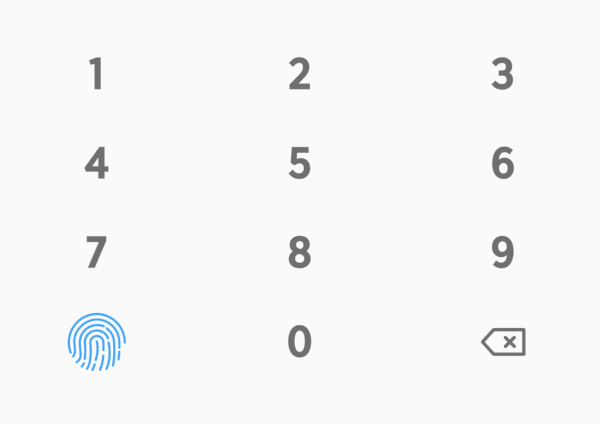

# pin_keyboard

A Pin Keyboard Flutter package, Make it easy to use and minimal code.

[](https://www.buymeacoffee.com/prongbang)



## Usage

```dart
PinKeyboard(
    length: 4,
    enableBiometric: true,
    iconBiometricColor: Colors.blue[400],
    onChange: (pin) {},
    onConfirm: (pin) {},
    onBiometric: () {},
)
```
